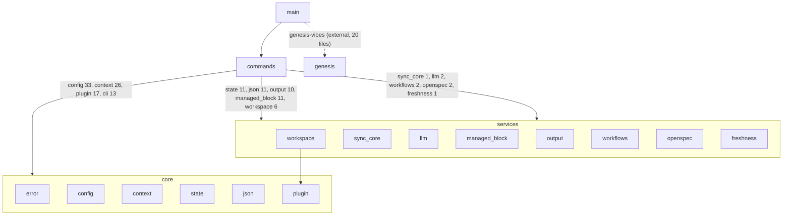

# Cartography — wai (`src/`)

**Entry zoom level:** macro (whole-system topology)
**Scope covered:** `src/*.rs` (22 top-level modules, ~9.6k lines), `src/commands/` (19 flat command modules + 7 submodules, ~6.6k lines, ~29 dispatched CLI commands), `Cargo.toml`, `tests/` layout

## Module inventory

| Module | Path | Responsibility (from evidence) | Deps out → | Fan-in (≈) |
| :---- | :---- | :---- | :---- | :---- |
| config | `src/config.rs` | User/project config, project root discovery | error, genesis | 58 |
| context | `src/context.rs` | Thread-local CLI flags (json, no_input, yes, safe, quiet) | error | 45 |
| plugin | `src/plugin.rs` | Plugin model shared by sync/doctor/commands | error, context, config | 30 |
| error | `src/error.rs` | `WaiError` + miette diagnostics | — | 19 |
| state | `src/state.rs` | Phase enum (Research→Archive), project state files | error | 22 |
| json | `src/json.rs` | JSON output envelope helpers | config | 21 |
| output | `src/output.rs` | Output rendering (genesis envelope) | genesis | 17 |
| managed_block | `src/managed_block.rs` | Managed marker blocks in AGENTS.md | genesis | 12 |
| workspace | `src/workspace.rs` | `.wai/` workspace layout ops | plugin, managed_block, config, genesis | 8 |
| workflows | `src/workflows.rs` | Workflow definitions | state, json, config | 4 |
| openspec | `src/openspec.rs` | OpenSpec integration | config | 4 |
| freshness | `src/freshness.rs` | Project freshness/staleness signals | — | 1 |
| sync_core | `src/sync_core.rs` | Core sync logic (agent-tool projection) | error, context | 2 |
| llm | `src/llm.rs` | LLM calls — **only network I/O (reqwest+tokio)** | config | 2 |
| guided_flows | `src/guided_flows.rs` | Interactive guided flows | — | 1 |
| tutorial / help | `src/tutorial.rs`, `src/help.rs` | Onboarding + help rendering | config | low |
| commands | `src/commands/` | All 20 CLI command handlers | (see meso) | entry |
| cli / main | `src/cli.rs`, `src/main.rs` | Clap arg model; binary entry | genesis | 13 (all in commands) |
| lib | `src/lib.rs` | Public API for tests/external crates; re-exports `genesis::suggestions` | — | — |

## Dependency matrix (DSM)

Rows depend on columns. Inferred layering: **core** (error, config, context, state, json, plugin) ← **services** (workspace, sync_core, llm, workflows, openspec, freshness, managed_block, output…) ← **commands** ← **cli/main**. Inference labeled: derived from majority direction; no declared ARCHITECTURE doc found.

```
            error  config  context  state  json  plugin  services  commands  cli
error         —
config        ✦       —
context       ✦               —
state/json/   ✦       ✦                              —
plugin
services      ✦       ✦       ✦       ✦      ✦     ✦        —
commands      ✦       ✦       ✦       ✦      ✦     ✦        ✦        —      ✦
cli/main                      ✦                     ✦        ✦       ✦      —
```

No ↑ layer-skips observed: no core module imports services or commands; `cli` is imported only by `commands/*` (13 files).

## Module graph



## Child detail (meso): the `commands` district

- **Dispatcher:** `commands/mod.rs` maps `Commands` enum variants → `run()` handlers (`src/commands/mod.rs:41`).
- **Command groups:** flat files (init, status, new, add, sync, prime, …) plus 7 submodules: `doctor/` (3 files), `pipeline/` (6 files), `why/` (3), `way/` (6), `reflect/` (3), `resource/` (5), `artifacts/` (1).
- **Horizontal wiring:** 8 `use crate::commands` imports: 6 are shared-helper reuse (`require_project` by `pipeline/queries.rs:18`, `pipeline/orchestration.rs:16`, `pipeline/setup.rs:10`, `resource/skills.rs:12`, `resource/archive.rs:15`, plus `commands/mod.rs` internals); 2 are cross-feature logic reuse (`doctor/checks_basic.rs:519,560 → why` badge fns; `way/mod.rs:13 → resource::parse_skill_frontmatter`). No bypass of `mod.rs` dispatch observed.
- **Heaviest handlers:** `prime.rs` and `status.rs` (9 crate-imports each), `doctor/mod.rs` (17), `new.rs` (8).

## Key Relationships

- `commands → config` (33 call sites) — every command resolves project root/config first
- `commands → context` (26) — global CLI-flag access via thread-local (`src/context.rs:17`)
- `commands → plugin` (30) — plugin model is the shared vocabulary of doctor/sync/way
- `wai → genesis-vibes` (external crate, 20 files) — suggestions, envelope, managed_block, doctor checks come from the shared genesis library
- `llm.rs` is the sole network I/O surface (reqwest/tokio); everything else is filesystem + process I/O

## Structural Observations

- Clean layering: dependencies point strictly downward (core ← services ← commands ← cli); no cycles detected among top-level modules
- Hub modules by fan-in: `config` (≈58), `context` (≈45), `plugin` (≈30)
- Near-orphans (fan-in ≤2): `freshness`, `guided_flows`, `sync_core`, `llm` — each serves one or two commands
- Dual entry: `main.rs` (binary) vs `lib.rs` (library for tests/external crates), with `lib.rs` re-exporting `genesis::suggestions` verbatim
- `templates/` (TOML pipeline templates: `scientific-research`, `tdd-ro5`) ships as data alongside code; `tests/` has 24 per-command `*_test.rs` integration files plus `integration.rs`
- `crate::cli` is imported only by `commands/*` (13 files) — verified by targeted scan; an earlier bulk-scan discrepancy was a faulty `!commands/**` exclusion glob, since resolved

## Open Questions

- Is `freshness.rs` (fan-in 1) intended to grow into a shared service, or is it status-specific?

## Adjacent levels offered

Meso maps of each `commands/` submodule available (see index); micro traces of `wai prime`, `wai sync`, `wai why` available.
