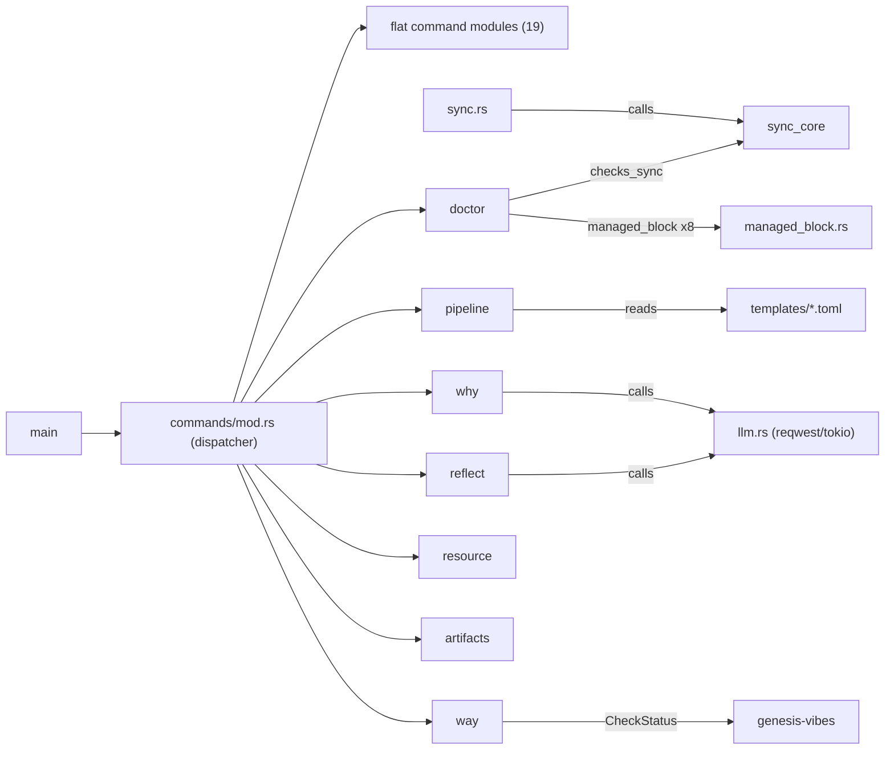

# Cartography — `commands` district (wai)

**Entry zoom level:** meso (module wiring)
**Scope covered:** `src/commands/` — `mod.rs`, 19 flat command modules, 7 submodules (~6.6k lines, ~29 dispatched CLI commands)

## Parent context

`commands` is the top layer of wai's inferred layering (core ← services ← commands ← cli/main). It contains every CLI command handler; `src/main.rs` dispatches into it via `commands::run()`. Its dependencies reach down into core modules (`config`, `context`, `plugin`) and services (`sync_core`, `llm`, `workspace`, …); `cli` is imported only by this district (13 files).

## Component table

| Component | Path | Role | Talks to (internal) | External ports |
| :---- | :---- | :---- | :---- | :---- |
| dispatcher | `commands/mod.rs` | Maps `Commands` enum variants → `run()` handlers (`src/commands/mod.rs:41`) | all command files; genesis Guide/SuggestionEngine | genesis |
| init / new / add | `init.rs`, `new.rs`, `add.rs` | Project creation, artifact creation, capture | workspace, state, json, cli, guided_flows, workflows | filesystem (`.wai/`) |
| read/report commands | `status.rs`, `show.rs`, `ls.rs`, `timeline.rs`, `project.rs`, `phase.rs`, `move_cmd.rs`, `close.rs`, `search.rs` | Read/report project state | state, json, output, context, config | filesystem (read) |
| sync | `sync.rs` | Sync agent tools | sync_core, plugin, context, config | filesystem |
| prime | `prime.rs` | Context priming (9 crate-imports) | workspace, context, state, json, workflows, openspec, freshness, genesis | filesystem |
| doctor/ | `doctor/{mod,checks_basic,checks_sync}.rs` | Health checks (17 crate-imports in `mod.rs`) | managed_block (8), workspace (3), config (2), sync_core | filesystem |
| pipeline/ | `pipeline/{mod,definition,gates,orchestration,queries,setup}.rs` | Pipeline lifecycle + gates | cli, config, commands, state | filesystem (`templates/` TOML) |
| why/ | `why/{mod,context,parsing}.rs` | Why-capture | llm, config, context, plugin, error | **network (via `llm.rs`)** |
| way/ | `way/{mod,hooks,linting,release}.rs` + 2 skill .md | Repo workflow enforcement | genesis CheckStatus, config, output, commands | genesis, external binaries |
| reflect/ | `reflect/{mod,context,meta}.rs` | Reflection capture | llm, context, config | network (via `llm.rs`) |
| resource/ | `resource/{mod,archive,metadata,skills,validation}.rs` | Resource CRUD + skills | commands, config | filesystem, tar |
| artifacts/ | `artifacts/mod.rs` | Artifact listing | commands, state, openspec | filesystem |
| plugin cmd | `plugin.rs` | Plugin management CLI | plugin, cli, context | filesystem |
| config cmd | `config_cmd.rs` | Config get/set | config, cli, context | filesystem |
| feedback / import / handoff | `feedback.rs`, `import.rs`, `handoff.rs` | Feedback, import, handoff docs | cli, config, genesis, state | filesystem |

## Wiring graph

## Structural observations

- Single fan-in point: everything is dispatched through `mod.rs`; only `cli` (13 importers) rivals `config`/`context` as shared infrastructure
- Horizontal wiring: 8 `use crate::commands` imports — 6 are shared-helper reuse (`require_project` by pipeline/ and resource/ submodules), 2 are cross-feature logic reuse (`doctor/checks_basic.rs:519,560 → why` badge fns; `way/mod.rs:13 → resource::parse_skill_frontmatter`); no observed bypass of the `mod.rs` dispatch for entry
- Heaviest handlers by crate-imports: `doctor/mod.rs` (17), `prime.rs` (9), `status.rs` (9), `new.rs` (8), `pipeline/queries.rs` (5)
- Network I/O is confined to `why/` and `reflect/`, both mediated by the single `llm.rs` service
- No caller-less components found within the district; every submodule is reached from the dispatcher

## Key Relationships

- `mod.rs → all handlers` — the enum-match dispatch is the district's only entry
- `why/ → llm.rs → network` — the only path to external LLM services
- `sync.rs / doctor → sync_core` — sync logic shared between command and health check
- `doctor → managed_block` (8 sites) — doctor validates the same marker blocks the service layer writes
- `way/* → genesis doctor checks` — enforcement logic delegated to the shared genesis crate

## Open Questions

- Are the 8 sibling-to-sibling imports (e.g., `checks_basic.rs → commands`) intentional reuse or candidates for promotion into the services layer?
- `pipeline/queries.rs` has the most crate-imports in its submodule (5) — is query logic accumulating responsibilities beyond reading?

## Adjacent levels offered

Micro traces of `wai prime`, `wai sync`, `wai why` available; per-submodule meso maps in the index.
