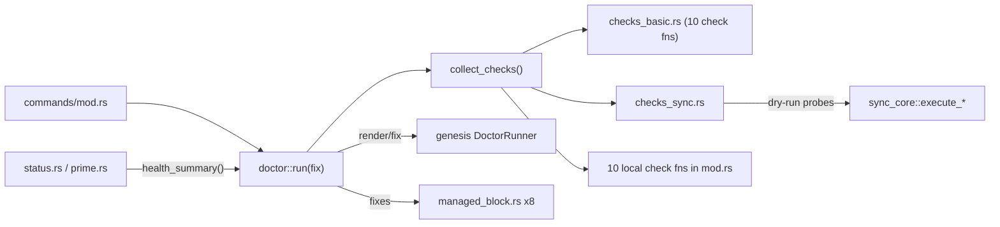

# Cartography — `commands/doctor/` (wai)

**Entry zoom level:** meso (module wiring)
**Scope covered:** `src/commands/doctor/` — `mod.rs` (1,959), `checks_basic.rs` (727), `checks_sync.rs` (489)

## Parent context

`doctor/` is a submodule of the `commands` district in wai's inferred layering (core ← services ← commands). It is dispatched via `commands/mod.rs` and is the district's heaviest component (17 crate-imports in `mod.rs`). It is consumed both by its own CLI command and by `status`/`prime` via `health_summary()` (`doctor/mod.rs`, doc comment above `health_summary`).

## Component table

| Component | Path | Role | Talks to (internal) | External ports |
| :---- | :---- | :---- | :---- | :---- |
| entry / fix | `doctor/mod.rs` `run(fix)` | Diagnostic vs fix mode; renders via genesis DoctorRunner | `collect_checks`, `checks_basic`, `checks_sync`, `workspace`, `managed_block` (8 imports), `config` | genesis DoctorRunner/CheckStatus |
| `collect_checks()` | `doctor/mod.rs` | Aggregates ~21 checks from both check files + 10 local check fns | all check fns | filesystem |
| `health_summary()` | `doctor/mod.rs` | Compact warn/fail report reused by `status.rs`, `prime.rs` | `build_doctor_runner` | — |
| `apply_fixes()` | `doctor/mod.rs` | Fix mode writes (managed blocks, config) | `managed_block`, `workspace` | filesystem (write) |
| basic checks | `checks_basic.rs` | directories, config, version, plugin tools, project state, custom plugins, wai-project env, README badge, badge/managed-block consistency, suite gates | `commands` (2 imports) | filesystem |
| sync checks | `checks_sync.rs` | `check_agent_config_sync`: verifies projections are up to date | re-parses `.projections.yml` with own `ProjectionsConfig` structs; calls `sync_core::execute_symlink/inline/reference` as dry-run probes | filesystem |

## Wiring graph

## Structural observations

- `checks_sync.rs` defines its own `ProjectionsConfig`/`ProjectionEntry` structs (`checks_sync.rs:13-21`) instead of importing from `sync.rs`/`sync_core` — the projection concept is parsed in 2 places and modeled in 3
- `doctor/mod.rs` at 1,959 lines is ~6× the repo file-size median (328, n=65); it hosts ~10 check functions inline in addition to entry/fix/render logic
- `health_summary()` gives doctor a second fan-in surface beyond the CLI (used by `status`, `prime`)
- Fix mode writes via `managed_block` — the same blocks `check_managed_block_staleness` validates

## Key Relationships

- `doctor → managed_block` (8 sites) — validation and repair of AGENTS.md marker blocks
- `doctor → sync_core` (dry-run) — health check replays sync execution without writing
- `status/prime → doctor::health_summary` — one-line health summary reused across commands
- `doctor → genesis` — check status model and runner delegated to shared crate

## Open Questions

- Should `checks_sync.rs` share the `ProjectionsConfig` type with `sync.rs` rather than re-defining it?

## Adjacent levels offered

Micro trace of a single check (e.g., `check_agent_config_sync` through `sync_core::execute_*` dry-runs) available on request.
