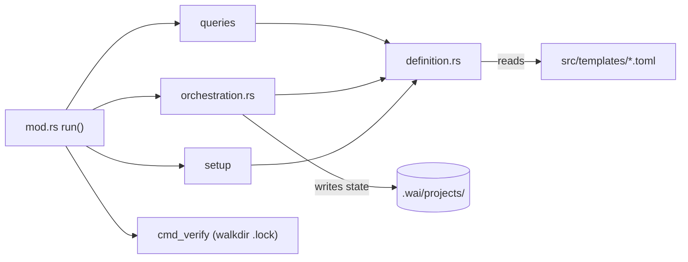

# Cartography — `commands/pipeline/` (wai)

**Entry zoom level:** meso (module wiring)
**Scope covered:** `src/commands/pipeline/` — `mod.rs` (1,920), `gates.rs` (758), `queries.rs` (596), `orchestration.rs` (415), `definition.rs` (157), `setup.rs` (146)

## Parent context

`pipeline/` is a submodule of the `commands` district, dispatched through `commands/mod.rs`. It implements the pipeline lifecycle (`wai pipeline start/gates/…`) backed by TOML templates shipped in `src/templates/`.

## Component table

| Component | Path | Role | Talks to (internal) | External ports |
| :---- | :---- | :---- | :---- | :---- |
| dispatcher | `mod.rs` `run(PipelineCommands)` | 14 subcommands → cmd fns (`mod.rs:187`) | queries, orchestration, setup, definition | — |
| `cmd_status` / `cmd_verify` | `mod.rs` | status delegates to `queries::cmd_current`; verify walks `.lock` files with walkdir | queries | filesystem (`.wai/projects/**/*.lock`) |
| definitions | `definition.rs` | TOML pipeline definition model | — | `src/templates/*.toml` (tdd-ro5, scientific-research) |
| gates | `gates.rs` | Gate enforcement logic (largest submodule file) | definition | filesystem |
| orchestration | `orchestration.rs` | `start`, `next`, `approve`, `lock` lifecycle transitions | definition, cli, state | filesystem (state writes) |
| queries | `queries.rs` | `list`, `current`, `suggest`, `show`, `gates`, `check`, `validate` read paths | definition, state, json | filesystem (read) |
| setup | `setup.rs` | `init <name>` scaffolding | definition | filesystem (write) |

## Wiring graph

## Structural observations

- `mod.rs` (1,920) is ~6× the file-size median (328, n=65) yet is a dispatcher plus only 2 inline commands — bulk likely gates/support code worth confirming
- Clean split: orchestration mutates, queries read, setup scaffolds, definition models — no observed query→orchestration calls
- Templates are compiled-in data (`include` in Cargo.toml covers `src/**`), read via `definition.rs`

## Key Relationships

- `orchestration → definition` — every lifecycle transition validates against the TOML pipeline definition
- `queries → state/json` — read-only reporting shares the state model with the rest of wai
- `pipeline → templates/` — pipeline kinds are data, not code; adding a pipeline needs no Rust change

## Open Questions

- Why does `mod.rs` hold 1,920 lines when it dispatches to 4 submodules — is `gates` logic partially inlined there?

## Adjacent levels offered

Micro trace of `pipeline start` (orchestration start → gate checks → state write) available on request.
