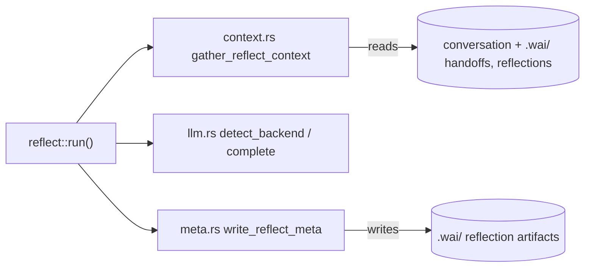

# Cartography — `commands/reflect/` (wai)

**Entry zoom level:** meso (module wiring)
**Scope covered:** `src/commands/reflect/` — `mod.rs` (855), `context.rs` (612), `meta.rs` (315)

## Parent context

`reflect/` is a submodule of the `commands` district. Like `why/`, it consumes the `llm` service (one of only two network-capable command paths) and writes new artifacts back into the `.wai/` store.

## Component table

| Component | Path | Role | Talks to (internal) | External ports |
| :---- | :---- | :---- | :---- | :---- |
| entry | `mod.rs` `run(ReflectArgs)` | Gather context → LLM reflection → persist meta/resource; `AGENT_SENTINEL` passthrough (`mod.rs:17` imports) | `context.rs`, `meta.rs`, `llm`, `config` | — |
| context | `context.rs` `gather_reflect_context()` (`context.rs:296`) | Conversation transcript (budgeted), handoffs, secondary artifacts, previous reflections | config | filesystem, conversation file |
| budget helpers | `context.rs` | `truncate_from_top`, `read_handoffs`, `read_secondary_artifacts`, `read_previous_reflections`, `count_handoffs_since` | — | filesystem (read) |
| meta | `meta.rs` | `read/write_reflect_meta`, `write_reflect_resource`, `predict_reflect_resource_path` | config | filesystem (write) |

## Wiring graph

## Structural observations

- Budget-driven context assembly: every input source (conversation, handoffs, artifacts, previous reflections) is truncated to a character budget before prompt assembly — pure functions on strings (`context.rs:66`)
- Mirrors `why/` structure (entry + context + persistence split) but adds the write-back path via `meta.rs` — `why/` only reads
- `run` tolerates a missing project (falls back to `None` rather than erroring, `mod.rs` comment) — unlike most commands which `require_project()`
- Writes go through `predict_reflect_resource_path` — output location computed, not discovered

## Key Relationships

- `reflect → llm.rs` — same backend abstraction as `why/` (claude-cli / ollama / API)
- `reflect → .wai/ artifacts` — reads prior reflections and handoffs, writes new reflection artifacts (feedback loop into its own future context)
- `reflect/meta → config` — path resolution through the shared project model

## Open Questions

- `why/` and `reflect/` share the gather-context → backend → format shape — is a shared prompt-assembly helper deliberately avoided?

## Adjacent levels offered

Micro trace of `wai reflect` (context budgets → LLM call → meta write) available on request.
