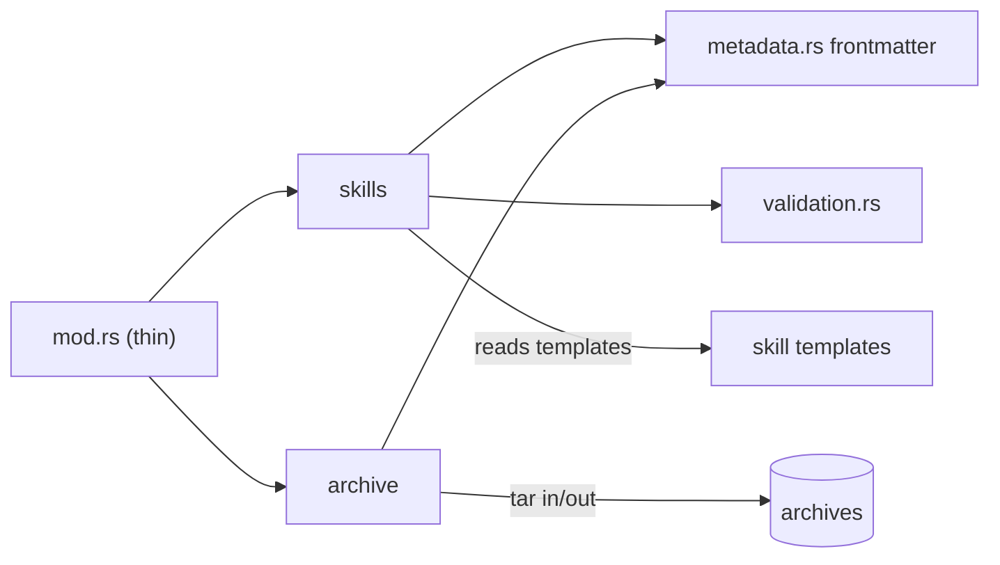

# Cartography — `commands/resource/` (wai)

**Entry zoom level:** meso (module wiring)
**Scope covered:** `src/commands/resource/` — `skills.rs` (814), `archive.rs` (470), `metadata.rs` (248), `validation.rs` (242), `mod.rs` (72)

## Parent context

`resource/` is a submodule of the `commands` district implementing the `wai resource` / `wai add skill` surface: CRUD for `.wai/` resources (research, skills, memories) with import/export.

## Component table

| Component | Path | Role | Talks to (internal) | External ports |
| :---- | :---- | :---- | :---- | :---- |
| dispatcher | `mod.rs` | Thin: `run_add`, `run_list`, `run_import`, `run_install`, `run_export` (`mod.rs:21-70`) | skills, archive, validation | — |
| skills | `skills.rs` | `add_skill(name, template)` and skill management; largest file | metadata, validation | filesystem (`.wai/resources/`), embedded templates |
| archive | `archive.rs` | Archive/restore resources | metadata | filesystem (archive dirs) |
| metadata | `metadata.rs` | `parse_skill_frontmatter` — skill YAML frontmatter model | — | filesystem (read) |
| validation | `validation.rs` | `validate_skill_name` (slug rules) | — | — (pure-ish) |
| import/export | `mod.rs` + `archive.rs` | tar-based packaging (cargo `tar`, `pathdiff`) | metadata | tar archives, filesystem |

## Wiring graph

## Structural observations

- Thinnest dispatcher in the district (72 lines) — entry logic lives in the feature files, inverse of `doctor`/`way`/`pipeline`
- `skills.rs` at 814 lines is ~2.5× the file-size median (328, n=65) — the district's weight center
- Validation is isolated as a pure function with its own file — the only validation logic separated from I/O in `commands/`
- Import/export is the only use of the `tar`/`pathdiff` dependencies outside `sync_core`

## Key Relationships

- `resource → .wai/resources/` — the same artifact store that `why`/`reflect` read for context
- `skills → metadata` — frontmatter parsing is the shared contract between add, list, import, export
- `archive ↔ metadata` — archive round-trips validate through the same frontmatter model

## Open Questions

- Is `add_skill` in `skills.rs` (also reachable as `wai add skill`) the same handler invoked by `commands/add.rs`, or a duplicated path?

## Adjacent levels offered

Micro trace of `wai resource import` (tar → frontmatter validation → resource write) available on request.
