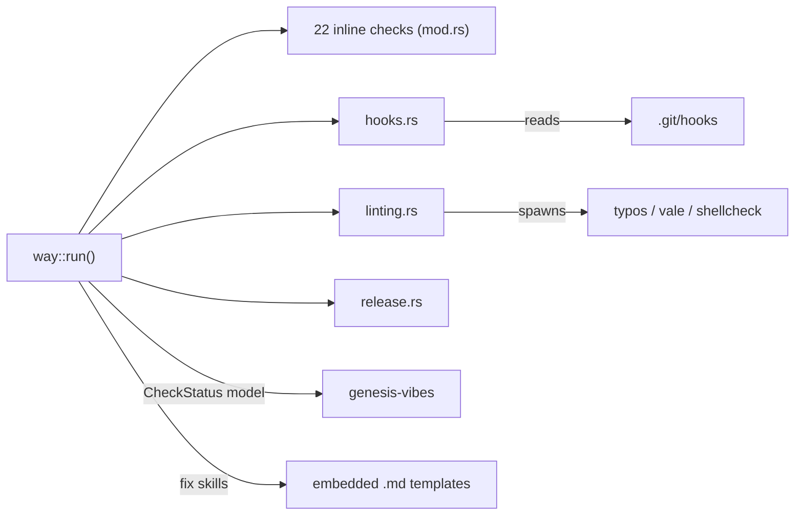

# Cartography — `commands/way/` (wai)

**Entry zoom level:** meso (module wiring)
**Scope covered:** `src/commands/way/` — `mod.rs` (2,975), `hooks.rs` (516), `linting.rs` (317), `release.rs` (144), plus 2 embedded skill markdown templates

## Parent context

`way/` is a submodule of the `commands` district. It enforces repo workflow quality (linting, hooks, docs, CI) on any directory — it does not require `.wai/` initialization (`mod.rs:47` comment).

## Component table

| Component | Path | Role | Talks to (internal) | External ports |
| :---- | :---- | :---- | :---- | :---- |
| entry | `mod.rs` `run(topic, fix)` (`mod.rs:46`) | 22 inline checks + topic guides + `fix skills` | `hooks.rs`, `linting.rs`, `release.rs`, `current_context`, genesis CheckStatus | filesystem, git repo |
| check functions (22) | `mod.rs` inline | task runner, editorconfig, docs status page, openspec inclusion, AI instructions, llms.txt, ubiquitous language, skills, config sync, gh CLI, pretender, CI/CD, devcontainer, test coverage, beads, openspec, … | genesis CheckStatus | external binaries (gh, etc.) |
| git hooks | `hooks.rs` | `check_git_hooks` | genesis CheckStatus | `.git/hooks`, lefthook config |
| linting | `linting.rs` | `check_typos`, `check_vale`, `check_shell_linting` | genesis CheckStatus | external binaries (typos, vale, shellcheck) |
| release | `release.rs` | `check_release_pipeline` | genesis CheckStatus | CI config files |
| fix target | `mod.rs` `fix_skills` | repairs skill files using embedded `.md` templates | — | filesystem (write) |

## Wiring graph

## Structural observations

- `way/mod.rs` at 2,975 lines is the largest file in `src/` — ~9× the file-size median (328, n=65) and ~3× the next-largest module file
- All 22 checks return the shared `CheckStatus` from genesis; the district adds no check model of its own
- Exit-code discipline: `run` always exits 0 (`mod.rs` comment) — recommendations, not requirements, unlike `doctor`
- External binary probes (typos, vale, shellcheck, gh) are executed from `linting.rs`/`mod.rs` — the only subprocess linters in the district

## Key Relationships

- `way → genesis CheckStatus` — check model fully delegated to shared crate
- `way/mod.rs → external binaries` — quality gates evaluated by spawning tools, not reimplementing them
- `way → repo root` — operates on any git repo (no `.wai/` requirement), unlike every other command

## Open Questions

- Is the 2,975-line `mod.rs` (22 inline checks) a deliberate single-file-per-check convention, or accumulated growth?

## Adjacent levels offered

Micro trace of one check (e.g., `check_agent_config_sync` reuse vs `doctor`'s version) available on request.
