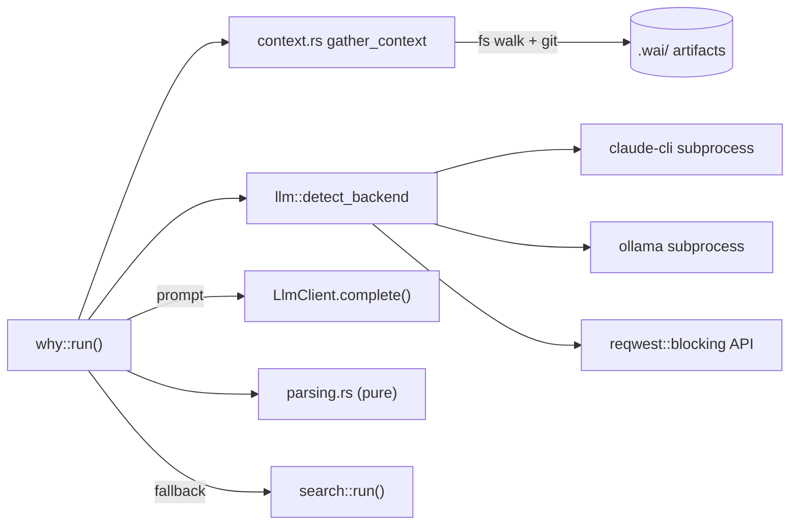

# Cartography — `commands/why/` (wai)

**Entry zoom level:** meso (module wiring)
**Scope covered:** `src/commands/why/` — `mod.rs` (1,163), `context.rs` (623), `parsing.rs` (387)

## Parent context

`why/` is a submodule of the `commands` district. It is the primary consumer of the `llm` service — together with `reflect/`, the only path to network/subprocess LLM backends in wai.

## Component table

| Component | Path | Role | Talks to (internal) | External ports |
| :---- | :---- | :---- | :---- | :---- |
| entry / backend selection | `mod.rs` `run(query, no_llm, json, verbose)` (`mod.rs:438`) | Context → backend → prompt → complete → parse → format; fallbacks to search | `context.rs`, `parsing.rs`, `llm`, `config`, `search::run` fallback | — |
| context gathering | `context.rs` `gather_context()` (`context.rs:117`) | Reads `.wai/` artifacts (recent-first), truncates to budget, git file context, meta, memories | config | filesystem walk, git subprocess |
| response parsing | `parsing.rs` | Parse LLM response into structured answer | — | — (pure) |
| backend abstraction | `llm.rs` (service layer, outside district) | `LlmClient` trait; detect_backend chooses claude-cli / ollama / external API | config | subprocess (`Command::new`), `reqwest::blocking` (`llm.rs:134`) |

## Wiring graph

## Structural observations

- Three-tier fallback ladder: no backend → `search::run`; backend error → `search::run` (unless `FallbackMode::Error`); empty context → early exit — all three fallback sites call the same `SearchArgs` construction (`mod.rs:445,529,585`)
- Backend I/O is fully confined to `llm.rs`; `why/` itself touches only filesystem + git
- One-time privacy notice before external API calls (`privacy_notice_needed` / `mark_privacy_notice_shown`, `mod.rs:546-548`)
- Agent-session sentinel: when running inside an agent, the response sentinel short-circuits output (`mod.rs:549-554`)

## Key Relationships

- `why → llm.rs` — backend selection + completion; the district never sees HTTP or subprocess details
- `why → search` (3 fallback sites) — degraded mode reuses the search command wholesale
- `context.rs → .wai/ artifacts` — same artifact store that `add`/`import` populate

## Open Questions

- The repeated `SearchArgs { … context_size: 0 … }` construction at 3 fallback sites — is a shared fallback helper intentional to avoid?

## Adjacent levels offered

Micro trace of the full `wai why` path is available (`cartography-micro-why`).
